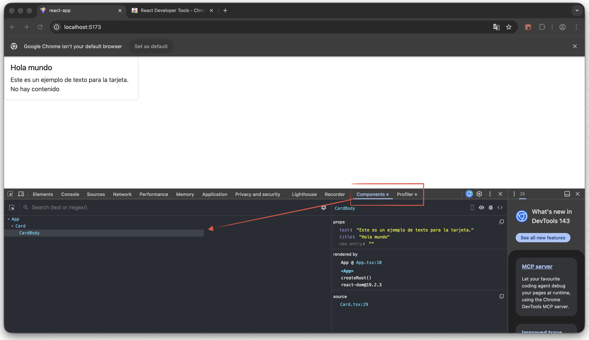
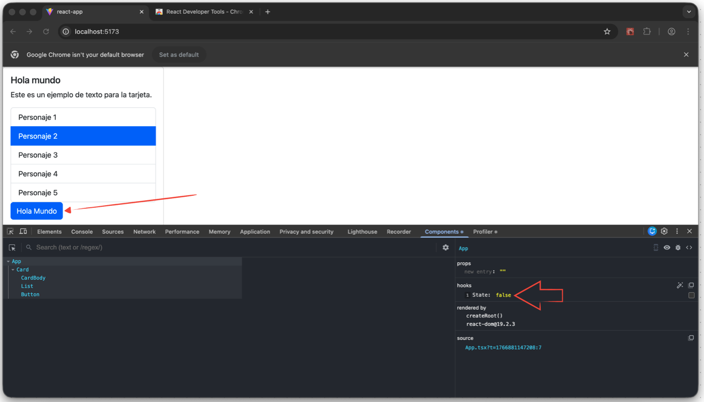
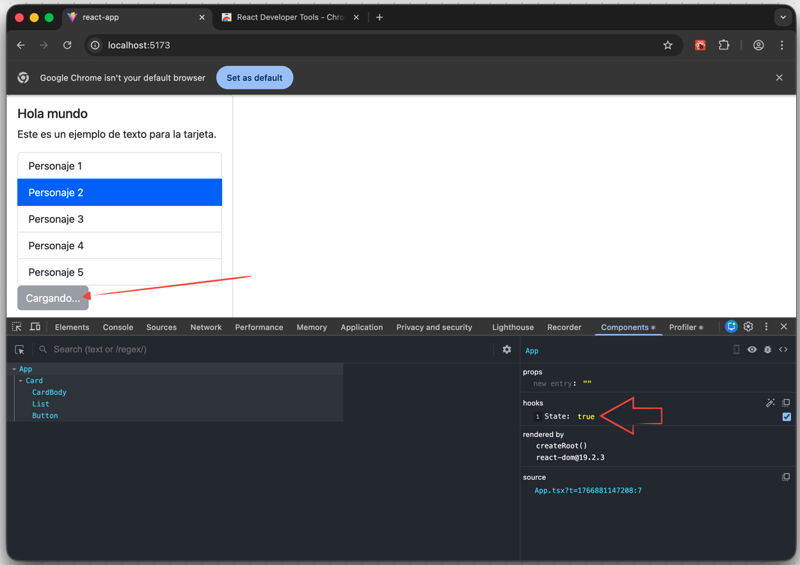

<!-- Atajos -->
<!-- tsrfce <- atajo del snippet (typescript react functional component export) -->
<!-- ` <- comillas raras -->

## Truthy vs Falsy — Ejemplo

```tsx
import Card, { CardBody } from "./components/Card";
import List from "./components/List";
/**
 * truthy values: cualquier valor que no sea falsy
 * falsy values: 0, "", null, undefined, NaN, false
 */

function App() {
  const list = [
    "Personaje 1",
    "Personaje 2",
    "Personaje 3",
    "Personaje 4",
    "Personaje 5",
  ];

  const list2: string[] = [];

  const handleSelect = (elemento: string) => {
    console.log("Imprimiendo: ", elemento);
  };

  const handleSelect2 = (elemento: string) => {
    console.log("Mostrando: ", elemento);
  };
  // código jsx aquí -> se va a transformar a llamadas de React.createElement
  return (
    <Card>
      {"" && "String vacio"}
      {"Hola mundo" && "String hola mundo"}
      <br />
      {list2.length && "Mi lista 2"} {/* <- Se renderiza porque list2.length es 0 (falsy) pero detecta el 0 como un valor
			// Por eso hay que agregar una evaluación */}
      {list2.length !== 0 && "Mi lista 2"}{" "}
      {/* <- Ahora no se renderiza si list2 está vacía (0) */}
      <CardBody
        title="Hola mundo"
        text="Este es un ejemplo de texto para la tarjeta."
        // text2="Este es un texto opcional adicional." // <- Este texto es un parametro opcional
      />
      <List data={list} onSelect={handleSelect} />
      <List data={list} onSelect={handleSelect2} />
    </Card>
  );
}

export default App;
```

## Renderizado Condicional

Se encarga de almacenar la lógica de qué es lo que se renderiza y que no.
Recomendado para cuando el contenido es demasiado largo para calcular qué es lo que se va a mostrar.

```tsx
import Card, { CardBody } from "./components/Card";
import List from "./components/List";

function App() {
  const list = [
    "Personaje 1",
    //   "Personaje 2",
    //   "Personaje 3",
    //   "Personaje 4",
    //   "Personaje 5",
  ];

  // const list: string[] = [];

  const handleSelect = (elemento: string) => {
    console.log("Imprimiendo: ", elemento);
  };

  // const handleSelect2 = (elemento: string) => {
  //   console.log("Mostrando: ", elemento);
  // };

  // se encarga de almacenar la lógica de qué es lo que se renderiza y que no.
  const contenido = list.length ? (
    <List data={list} onSelect={handleSelect} />
  ) : (
    "Sin elementos para mostrar"
  );

  // código jsx aquí -> se va a transformar a llamadas de React.createElement
  return (
    <Card>
      <CardBody
        title="Hola mundo"
        text="Este es un ejemplo de texto para la tarjeta."
        // text2="Este es un texto opcional adicional." // <- Este texto es un parametro opcional
      />
      {contenido}
    </Card>
  );
}

export default App;
```

Parte 2:

```tsx
import Card, { CardBody } from "./components/Card";
import List from "./components/List";

function App() {
  // const list = [
  // "Personaje 1",
  //   "Personaje 2",
  //   "Personaje 3",
  //   "Personaje 4",
  //   "Personaje 5",
  // ];

  const list: string[] = [];

  const handleSelect = (elemento: string) => {
    console.log("Imprimiendo: ", elemento);
  };

  // // se encarga de almacenar la lógica de qué es lo que se renderiza y que no.
  //  renderiza un mensaje diciendo que no hay elementos para mostrar
  // const contenido = list.length ? (
  //   <List data={list} onSelect={handleSelect} />
  // ) : (
  //   "Sin elementos para mostrar"
  // );

  // se encarga de almacenar la lógica de qué es lo que se renderiza y que no.
  // no renderiza un mensaje diciendo que no hay elementos para mostrar
  const contenido = list.length !== 0 && (
    <List data={list} onSelect={handleSelect} />
  );

  // código jsx aquí -> se va a transformar a llamadas de React.createElement
  return (
    <Card>
      <CardBody
        title="Hola mundo"
        text="Este es un ejemplo de texto para la tarjeta."
        // text2="Este es un texto opcional adicional." // <- Este texto es un parametro opcional
      />
      {contenido}
    </Card>
  );
}

export default App;
```

# React Developer Tools (Chrome version)

Link: https://chromewebstore.google.com/detail/react-developer-tools/fmkadmapgofadopljbjfkapdkoienihi


## Example of checking state

In this case the button is enabled with the hook State true.


After click on the button the button is disabled and the hook State false.

